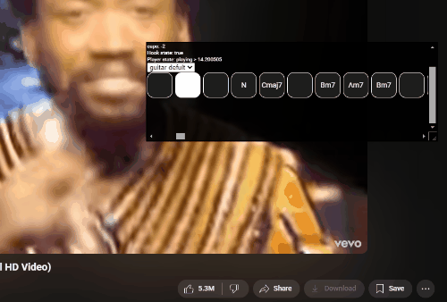

# youtube_guitar_chords_overlay
Detect youtube/youtube music url and show guitar chord overlay.\

## Song database
[public firestore link](https://firestore.googleapis.com/v1/projects/guitar-chords-873b9/databases/(default)/documents/guitar-chords/)  
current database only a few song, plan to be added later by user or AI autogenerate or web scraping.

## Installation
- download this repo as zip and extract
- goto `chrome://extensions` and Enable developer mode
- click `Load unpacked` and select `src/` folder
- goto [this video](https://youtu.be/A_MjCqQoLLA?si=khlDnW3jS4VTpJZz&t=52)

## Features
- support one row and table mode
- support dynamic tempo
- support multiple chords version e.g. capo profile or bass and piano chord

## TODO
- [ ] Chord image guide
- [ ] show custom message at specific time e.g. let user know when tempo changed or need to change capo fret
- [ ] function for submitting a chords via a pop up window
