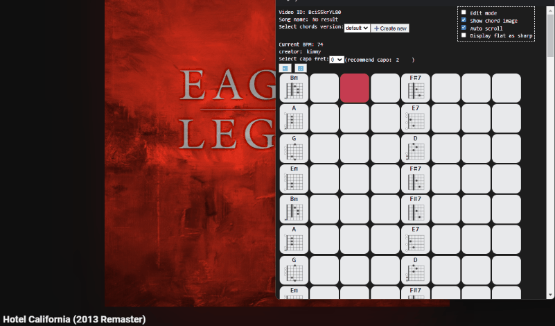
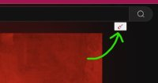
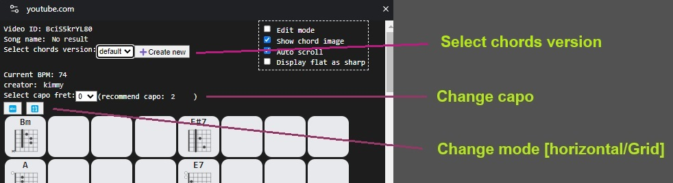
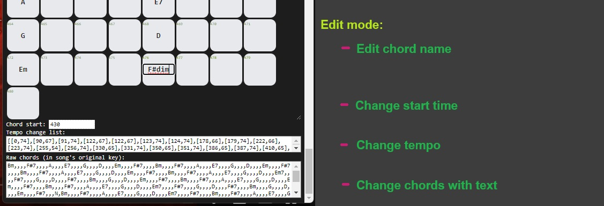

# youtube_guitar_chords_overlay
Detect youtube/youtube music url and show guitar chord overlay.\
The chords are load from `my database` when start the plugin

## Song database

[example list](https://www.youtube.com/playlist?list=PLFVrghbPJS58f8FIxA-cZVBMfWzxEwXZ6)

Currently only have a song that I'm practicing, feel free to add your own song via the plugin (check the Create/Edit section)

## Installation
- download this repo as zip and extract
- goto `chrome://extensions` and Enable developer mode
- click `Load unpacked` and select `src/` folder

## Basic usage
1. Open youtube video ([example](https://www.youtube.com/watch?v=hTWKbfoikeg)) and click on "Guitar 🎸 icon" above video to open the window

\

## Create/Edit mode
- When open a song you can edit existing chords or create a new one by click on edit mode\
- Or you can create a new one by click `Create new`
\

|   |   |   |
|---|---|---|
| Chord start  |  time in milliseconds before play the first chord |
| Tempo change list  | pair of [beat, tempo value] for changing tempo in the song|
| Raw chords | Chord list in text format for backup, quick edit, add beats|

Tips:
- Some song might have inconsistent beat, you can edit `Tempo change list` to mimic the played tempo
- You can add more beat by adding `,,,,,,` in the `Raw chords`

## TODO
- [ ] chord shape variations
- [ ] pitch shift audio 
